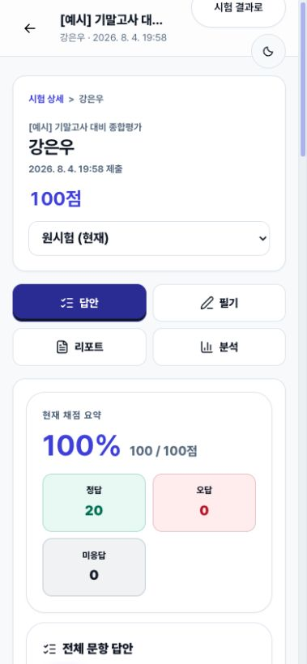
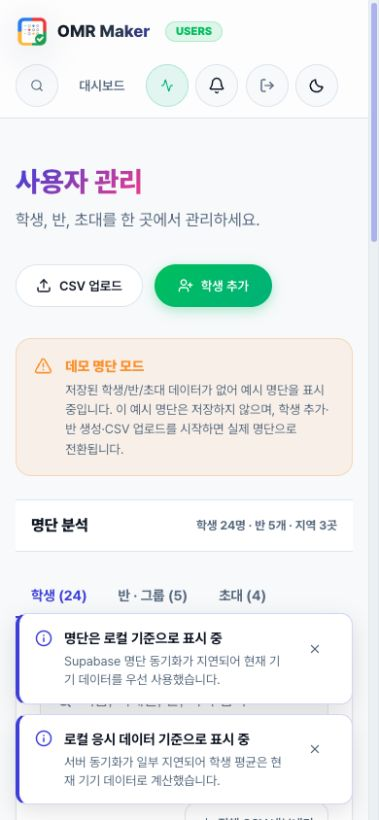
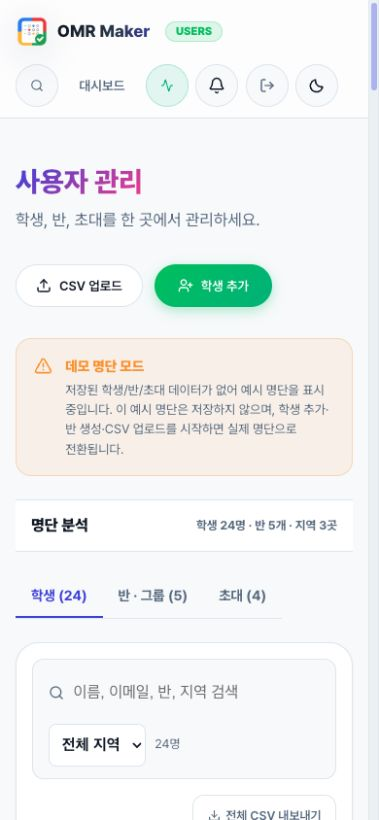
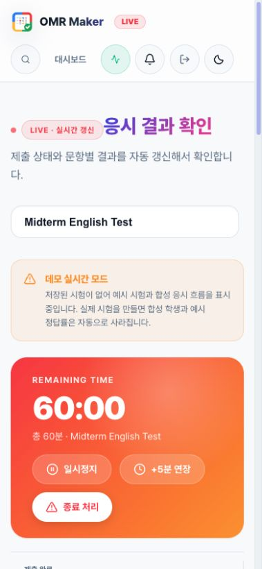
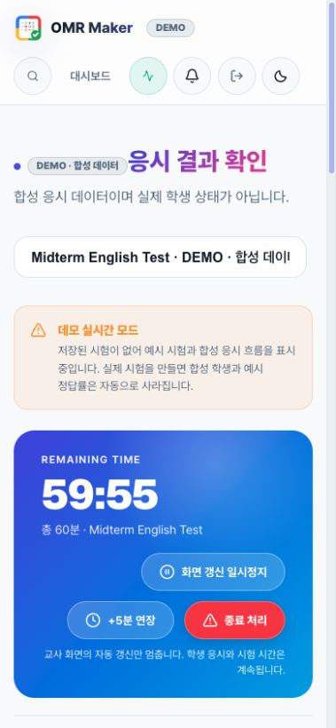
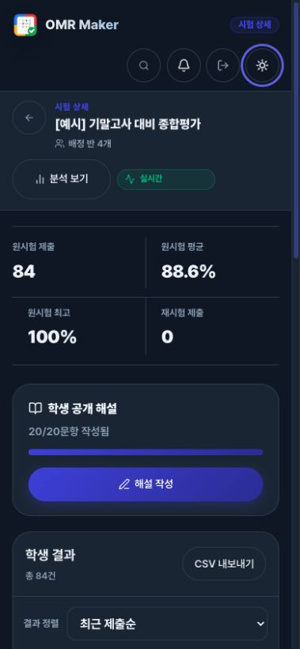
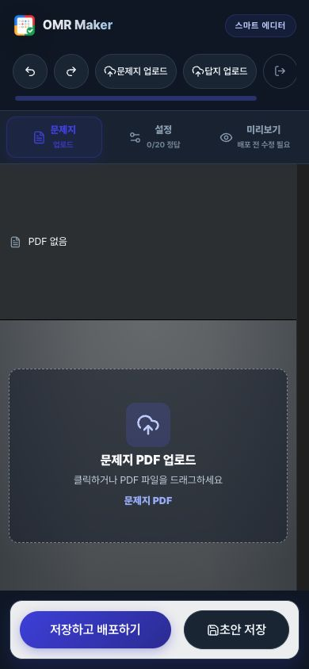
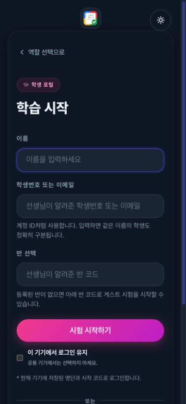
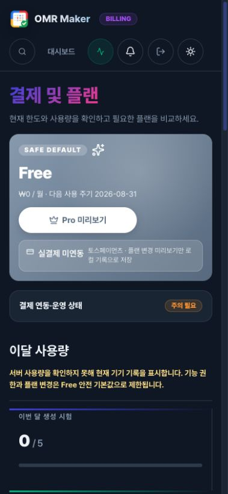

# OMR Maker UI/UX 세부 감사 — 2026-08-05

## 결과

- 가중 품질 점수: **9.28 / 10**
- 전체 핵심 경로 평균: **9.24 / 10**
- 최저 핵심 경로: **9.0 / 10** (`/student/history`)
- 합격 기준: 가중 점수 9.2 이상, 경로 평균 9.2 이상, 핵심 경로 9.0 미만 없음
- 검증 화면: 모바일 390×844, 데스크톱 1440×900, 실제 프로덕션 빌드
- 디자인 기준: [OMR Maker UI/UX development](https://www.figma.com/design/qKmrOGYzcGFVFKcYlkoFbs), 페이지 `04 UIUX Development · 2026-08-04`

## 10개 세부 평가 축

| 평가 축 | 가중치 | 점수 | 확인 기준과 판정 |
| --- | ---: | ---: | --- |
| 과업 진입·발견성 | 12% | 9.3 | 역할 선택, 학생 시작, 교사 데모, 출제 완료 작업이 한 화면에서 식별된다. |
| 정보 계층 | 12% | 9.4 | 제목 → 상태 → 핵심 수치 → 다음 행동 순서가 교사·학생 핵심 화면에서 유지된다. |
| 여백·리듬 | 10% | 9.2 | 8px 계열 간격, 카드 내부 여백, 섹션 간 호흡이 모바일과 데스크톱에서 안정적이다. |
| 타이포그래피 | 8% | 9.2 | 제목, 보조 설명, 수치, 라벨의 크기·굵기 대비가 일관되고 긴 한국어가 안전하게 줄바꿈된다. |
| 강조·색 의미 | 10% | 9.3 | primary는 다음 행동, error는 종료/실패, warning은 주의, success는 완료에 제한된다. |
| 인지 부하·덜어내기 | 12% | 9.2 | 모바일 표를 카드로 바꾸고, 토스트 중첩을 1개로 제한하며, 완료 작업을 2개로 축소했다. |
| 상태·피드백 | 10% | 9.4 | loading/ready/error, demo/live/upcoming/completed, 저장·배포 상태가 서로 다른 문구와 복구 행동을 가진다. |
| 반응형·리플로우 | 10% | 9.3 | 390px 명단에서 표를 숨기고 카드 24개를 제공하며 가로 overflow가 없다. |
| 접근성 | 8% | 9.0 | native form/label, dialog focus/Escape 복원, 44px PDF 터치 타깃, live region을 확인했다. 자동 명암 스캔은 미실행이다. |
| 신뢰·오류 복구 | 8% | 9.4 | 깨진 데모 결과 링크, 성공으로 보이던 학생 로드 실패, 과장된 실시간 제어, 무동의 장기 세션 보관을 제거했다. |

가중 계산: `(9.3×12 + 9.4×12 + 9.2×10 + 9.2×8 + 9.3×10 + 9.2×12 + 9.4×10 + 9.3×10 + 9.0×8 + 9.4×8) / 100 = 9.28`.

## 경로별 냉정 점수

| 경로 | 점수 | 핵심 근거 |
| --- | ---: | --- |
| `/` 역할·로그인 | 9.3 | 역할이 즉시 구분되고, 학생 계정 폼은 native submit/label과 지속 오류 메시지를 사용한다. |
| `/student/dashboard` | 9.2 | 원격 실패를 완료/빈 상태로 위장하지 않고 원인·재시도·로그인 복구를 제공한다. |
| `/student/history` | 9.0 | 빈 상태와 복구 행동은 명료하나 학생 내비게이션 연결성이 더 강화될 여지가 있다. |
| `/create` | 9.2 | 모바일 완료 바를 `저장하고 배포하기 / 초안 저장` 두 행동으로 정리했다. |
| `/pwa-check` | 9.1 | 핵심 점검 우선, 통과 항목은 disclosure로 덜어냈다. |
| `/solve/[id]` | 9.1 | PDF·OMR 과업 우선순위와 44px 필기 도구를 유지한다. |
| `/student/review/[attemptId]` | 9.2 | 긴 해설·학생 질문·교사 답변이 잘리지 않고 탭별 점진 공개를 유지한다. |
| `/teacher/attempt/[attemptId]` | 9.4 | 데모 결과가 실제 84명 fixture와 연결되고 로딩 상태가 한국어 live status로 안내된다. |
| `/teacher/dashboard` | 9.5 | KPI, 추세, 우선 조치, 최근 시험의 스캔 순서가 가장 강하다. |
| `/teacher/exam/[id]` | 9.4 | 모바일 6명 단위 결과, 명확한 load-more, 완전한 다크 테마를 제공한다. |
| `/teacher/live` | 9.4 | LIVE/준비/완료/DEMO를 분리하고 로컬 일시정지를 `화면 갱신`으로 정확히 표현한다. |
| `/teacher/settings` | 9.1 | 운영 상태와 고급 설정을 접어 핵심 설정을 먼저 보여준다. |
| `/teacher/users` | 9.4 | 모바일 전용 명단 카드와 인라인 데이터 출처 안내로 표 overflow·토스트 방해를 없앴다. |
| `/teacher/billing` | 9.2 | 플랜 권한 실패를 사용량 위 고정 인라인 상태로 표시해 콘텐츠를 가리지 않는다. |
| `/groups` | 9.1 | 반·지역·학생 요약과 관리 행동이 일관되나 교사 전역 내비게이션 확장 여지가 있다. |

## 감사 및 개선 절차

1. 390×844와 1440×900 프로덕션 화면을 새로 캡처했다.
2. 과업·계층·여백·타입·색·덜어내기·상태·반응형·접근성·신뢰의 10축으로 기준선을 매겼다.
3. 세 명의 독립 리뷰가 명단 반응형, 접근성/신뢰, 실시간 의미를 각각 검사했다.
4. P1 경로를 먼저 수정했다: 깨진 결과 링크, 학생 실패 상태, 가짜 일시정지 의미, 모바일 명단 overflow.
5. 강조와 덜어내기를 적용했다: 토스트 1개 제한, 수동 초안 저장, 모바일 완료 작업 2개, passive 상태 인라인화.
6. TDD의 RED→GREEN을 거쳐 186개 파일 1,411개 테스트, 변경 파일 ESLint, TypeScript 포함 프로덕션 빌드를 통과했다.
7. 수정된 프로덕션 화면을 동일 브라우저에서 다시 열어 DOM 의미와 실제 픽셀을 함께 확인했다.

## 시각 증거

### 1. 끊긴 학생 결과 경로 → 완전한 상세 결과

수정 전에는 쇼케이스 결과 링크가 `응시 기록을 찾을 수 없습니다`로 끝났다.

수정 후에는 시험·학생·점수·20개 답안·리포트/분석 탭이 일관된 fixture에서 로드된다.

### 2. 가로 표·중첩 토스트 → 모바일 명단 카드·인라인 안내

### 3. 위험색 경쟁 → 상태와 파괴 행동만 강조

기존 실시간 화면에서는 LIVE, 시간, 미응시, 종료가 모두 붉은 계열로 경쟁했다.

수정 후에는 DEMO/실시간 상태를 텍스트와 칩으로 먼저 설명하고, red는 `종료 처리`에만 남겼다.

### 4. 고정 라이트 색상 → 토큰 기반 다크 테마

### 5. 저장 의미를 명시한 모바일 완료 바

### 6. 개인정보 보관은 기본 해제·명시적 동의

### 7. 플랜 확인 실패는 콘텐츠를 가리지 않는 인라인 상태

## 강조와 덜어내기 원칙

1. 한 화면의 primary는 다음 과업 한 개에만 사용한다.
2. 위험색은 실제 실패·종료·삭제에만 사용한다.
3. passive 상태는 toast가 아니라 해당 데이터 바로 위 인라인 상태로 둔다.
4. 모바일에서는 넓은 표를 축소하지 않고 핵심 정보 카드로 재구성한다.
5. 고급·진단·과거 기록은 disclosure 뒤에 두되 키보드와 의미 구조를 보존한다.
6. 자동 저장은 보조 안전망으로 두고 사용자가 이해할 수 있는 `초안 저장`을 제공한다.
7. 개인 식별정보는 세션 탭에만 저장하고 장기 보관은 명시적으로 동의받는다.

## 남은 9.5 후보

- 학생 로그인에서 명단 로그인·반 코드 게스트·코드 없는 게스트를 단계형 선택으로 더 분리한다.
- 교사 전역 헤더에서 명단·설정·결제의 깊은 경로를 검색 외 한 번의 메뉴로 제공한다.
- `/create`의 데스크톱 툴바와 inline style을 공통 컴포넌트·토큰으로 더 축소한다.
- 자동 axe/명암 검사를 CI에 추가해 현재의 토큰·수동 확인을 정량 검증한다.

## 검증 증거

- Vitest: **186 files, 1,411 tests passed**
- ESLint: 변경된 핵심 파일 전체 통과
- TypeScript 및 production build: Next.js 16.2.12, 16개 route 생성 통과
- focused Chromium: 명단 모바일 2/2, 실시간 2/2, 학생 오류 복구 1/1 통과
- 인앱 브라우저: 데모 결과 링크, 84명 결과, 다크 테마, 모바일 명단, live 의미, 출제 완료 바, 학생 보관 동의, 결제 인라인 상태 확인
- 390px 명단: table hidden, 카드 24개, 가로 overflow 없음, console warning/error 없음
