# Supabase setup

1. In Supabase, open SQL Editor and run `supabase/schema.sql`.
2. Create `.env.local` in the project root:

```bash
NEXT_PUBLIC_SUPABASE_URL=https://wqhiajvisirxdjivhmlt.supabase.co
NEXT_PUBLIC_SUPABASE_PUBLISHABLE_KEY=sb_publishable_your_full_key_here
```

3. Restart the Next.js dev server after changing `.env.local`.

The app keeps localStorage as a fallback. When Supabase is configured, exams, attempts, and the teacher roster are synced to:

- `public.omr_organizations`
- `public.omr_user_profiles`
- `public.omr_organization_members`
- `public.omr_teacher_profiles`
- `public.omr_student_profiles`
- `public.omr_classes`
- `public.omr_class_teachers`
- `public.omr_class_students`
- `public.omr_materials`
- `public.omr_exam_materials`
- `public.omr_exams`
- `public.omr_exam_questions`
- `public.omr_assignments`
- `public.omr_assignment_targets`
- `public.omr_attempts`
- `public.omr_question_results`
- `public.omr_assignment_submissions`
- `public.omr_kakao_candidate_reviews`
- `public.omr_kakao_dispatch_logs`
- `public.omr_comments`
- `public.omr_audit_logs`

Canonical organization plans are `free`, `pro`, and `academy`. Older `school` rows are migrated to `academy` inside `schema.sql` so app entitlements, billing UI, and database constraints stay aligned.

`/teacher/users` writes student and class roster snapshots through `src/lib/rosterPersistence.ts`.
It stores students in `omr_student_profiles`, classes/regions in `omr_classes`, and membership in `omr_class_students` while keeping invite drafts local until the Kakao/provider invite flow is finalized.
Roster deletions are soft-synced: missing students are marked `withdrawn`, missing classes are marked `archived`, and old class memberships are marked `inactive` so historical attempts can keep their student/class references without making deleted rows reappear in the active roster.

Before changing persistence row mappings or `schema.sql`, run:

```bash
npm test -- --run src/lib/supabaseSchemaContract.test.ts src/lib/omrPersistence.test.ts src/lib/rosterPersistence.test.ts
```

The contract test checks that the SQL schema still exposes the roster, fact, region, retake, guest-merge, and Kakao pre-send columns/indexes used by the app.

## Data Model

The schema separates the current JSON sync surface from the future relational product model:

- `organization_id` separates academy, school, or teacher-owned data.
- `omr_user_profiles` stores global app user metadata without forcing every student to have an auth account.
- `omr_organization_members` is the workspace role boundary for owner/admin/teacher/assistant/viewer access.
- `omr_teacher_profiles` and `omr_student_profiles` keep role-specific metadata such as subjects, external student IDs, guardian contact, and roster status.
- `omr_class_teachers` and `omr_class_students` model many-to-many class membership.
- `omr_materials` stores worksheet/PDF/link/file metadata, while actual files should live in Supabase Storage.
- `omr_exam_materials` links reusable materials to exams as problem PDFs, answer keys, solutions, references, or attachments.
- `omr_exam_questions` stores one normalized row per exam question: answer, score, labels/tags, choice count, and PDF anchor/crop metadata. It does not store cropped question images; premium review can reconstruct the question area from the original problem PDF plus `pdf_region`.
- `omr_assignments` represents a distributed exam/work item with open/due/close windows.
- `omr_assignment_targets` scopes an assignment to a class, student, or group.
- `omr_attempts` remains compatible with the app's JSON payload sync and also exposes score, status, identity type, region, retake source, and guest-merge metadata as indexed columns for faster dashboards.
- `omr_question_results` stores one normalized result fact per attempt/question so premium analytics can slice wrong questions by student, class, region, exam, concept, source, difficulty, and mistake type without rehydrating every attempt payload.
- `omr_assignment_submissions` is the normalized assignment-gradebook layer that can point at an `omr_attempts` row.
- `omr_kakao_candidate_reviews` stores teacher-reviewed pre-send Kakao candidates such as missing-exam nudges and retake recommendations.
- `omr_kakao_dispatch_logs` is the provider-neutral audit trail for future Kakao send attempts, failures, and provider message IDs.
- `omr_comments` supports teacher-only and student-visible feedback on students, materials, exams, assignments, submissions, attempts, or questions.
- `omr_audit_logs` is the future trail for sensitive admin actions.

```mermaid
erDiagram
    omr_organizations ||--o{ omr_organization_members : has
    omr_organizations ||--o{ omr_teacher_profiles : has
    omr_organizations ||--o{ omr_student_profiles : has
    omr_organizations ||--o{ omr_classes : has
    omr_classes ||--o{ omr_class_teachers : assigns
    omr_classes ||--o{ omr_class_students : enrolls
    omr_student_profiles ||--o{ omr_class_students : joins
    omr_organizations ||--o{ omr_materials : owns
    omr_materials ||--o{ omr_exam_materials : attaches
    omr_exams ||--o{ omr_exam_materials : uses
    omr_exams ||--o{ omr_exam_questions : defines
    omr_exams ||--o{ omr_assignments : distributed_as
    omr_assignments ||--o{ omr_assignment_targets : targets
    omr_assignments ||--o{ omr_assignment_submissions : receives
    omr_student_profiles ||--o{ omr_assignment_submissions : submits
    omr_attempts ||--o| omr_assignment_submissions : normalizes
    omr_attempts ||--o{ omr_question_results : contains
    omr_exams ||--o{ omr_question_results : analyzes
    omr_exams ||--o{ omr_kakao_candidate_reviews : reviews
    omr_kakao_candidate_reviews ||--o{ omr_kakao_dispatch_logs : dispatches
    omr_organizations ||--o{ omr_comments : contains
    omr_organizations ||--o{ omr_audit_logs : audits
```



## Storage Plan

For large assets, keep metadata in Postgres and binary data in Supabase Storage:

- Problem PDFs: `omr_materials.material_type = 'problem_pdf'`
- Answer keys: `omr_materials.material_type = 'answer_key'`
- Solutions/explanations: `solution`, `worksheet`, `note`, or `link`
- File location: `storage_bucket` + `storage_path`
- External resources: `source_url`

## RLS warning

The current policies in `schema.sql` are intentionally open for alpha/local testing because the app does not have real Supabase Auth yet. Do not store real student data with these policies.

Before using production or sensitive real student data:

1. Enable Supabase Auth for teachers and students.
2. Replace public read/write policies with organization-scoped checks.
3. Restrict `omr_audit_logs` insert/read access by role.
4. Add server-side entitlement checks for Pro and Academy features.
5. Add data retention rules for archived handwriting.
