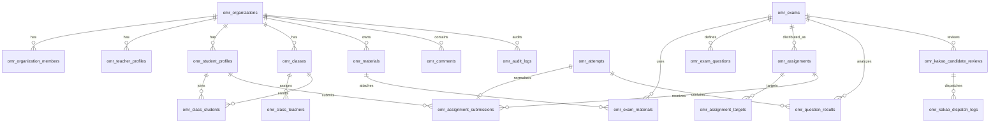

# Supabase setup

1. In Supabase, open SQL Editor and run `supabase/schema.sql`.
2. Create `.env.local` in the project root:

```bash
NEXT_PUBLIC_SUPABASE_URL=https://wqhiajvisirxdjivhmlt.supabase.co
NEXT_PUBLIC_SUPABASE_PUBLISHABLE_KEY=sb_publishable_your_full_key_here
SUPABASE_SERVICE_ROLE_KEY=server_only_service_role_key_for_workspace_bootstrap
```

3. Restart the Next.js dev server after changing `.env.local`.

The app keeps localStorage as a fallback. When Supabase is configured, exams, attempts, and the teacher roster are synced to:

- `public.omr_organizations`
- `public.omr_user_profiles`
- `public.omr_organization_members`
- `public.omr_teacher_profiles`
- `public.omr_student_profiles`
- `public.omr_classes`
- `public.omr_class_teachers`
- `public.omr_class_students`
- `public.omr_materials`
- `public.omr_exam_materials`
- `public.omr_exams`
- `public.omr_exam_questions`
- `public.omr_assignments`
- `public.omr_assignment_targets`
- `public.omr_attempts`
- `public.omr_question_results`
- `public.omr_assignment_submissions`
- `public.omr_kakao_candidate_reviews`
- `public.omr_kakao_dispatch_logs`
- `public.omr_comments`
- `public.omr_audit_logs`

Canonical organization plans are `free`, `pro`, and `academy`. Older `school` rows are migrated to `academy` inside `schema.sql` so app entitlements, billing UI, and database constraints stay aligned.

`/teacher/users` writes student and class roster snapshots through `src/lib/rosterPersistence.ts`.
It stores students in `omr_student_profiles`, classes/regions in `omr_classes`, and membership in `omr_class_students` while keeping invite drafts local until the Kakao/provider invite flow is finalized.
Roster deletions are soft-synced: missing students are marked `withdrawn`, missing classes are marked `archived`, and old class memberships are marked `inactive` so historical attempts can keep their student/class references without making deleted rows reappear in the active roster.

Before changing persistence row mappings or `schema.sql`, run:

```bash
npm test -- --run src/lib/supabaseSchemaContract.test.ts src/lib/workspaceContext.test.ts src/lib/omrPersistence.test.ts src/lib/rosterPersistence.test.ts
```

The contract test checks that the SQL schema still exposes the roster, fact, region, retake, guest-merge, and Kakao pre-send columns/indexes used by the app. The workspace-context tests check that app-managed teacher sessions create stable interim `teacher_<hash>` organization/user scopes without exposing raw email addresses in row ids.

## Live PostgreSQL CI gate

SQL migration semantics are release-blocking in `.github/workflows/ci.yml` under
`supabase-live-contract`. The job runs `scripts/verify-supabase-live.mjs` against
PostgreSQL 17 with `postgres` as the single migration owner and applies:

`schema.sql` → sorted `migrations` → `production-server-boundary.sql` →
`live-test-assertions.sql`

The server-only profile first calls
`omr_assert_production_boundary_preflight_v1`, then removes browser table,
sequence, and function privileges, removes alpha/legacy browser policies, and
keeps service-role RPC execution available. It also closes `storage.objects` and
`storage.buckets`; because Storage grants are table-wide, this intentionally
disables all browser Storage API CRUD, including buckets unrelated to OMR.
Uploads/downloads must use trusted service-role gateways. The assertions enumerate every
`public.omr_*` table, public sequence, and public function from PostgreSQL
catalogs, verify ENABLE + FORCE RLS, perform actual denied browser CRUD, and
exercise the service-role workflows and Storage CRUD.

Run `npm run test:supabase:live` locally when Docker is available. A machine
without Docker cannot replace this required CI gate with source-string
assertions.

## Data Model

The schema separates the current JSON sync surface from the future relational product model:

- `organization_id` separates academy, school, or teacher-owned data. Until Supabase Auth membership is connected, the app derives an interim `teacher_<hash>` organization scope from the active teacher session and falls back to `default` only when no teacher session is available.
- `omr_user_profiles` stores global app user metadata without forcing every student to have an auth account.
- `omr_organization_members` is the workspace role boundary for owner/admin/teacher/assistant/viewer access.
- `omr_teacher_profiles` and `omr_student_profiles` keep role-specific metadata such as subjects, external student IDs, guardian contact, and roster status.
- `omr_class_teachers` and `omr_class_students` model many-to-many class membership.
- `omr_materials` stores worksheet/PDF/link/file metadata, while actual files should live in Supabase Storage.
- `omr_exam_materials` links reusable materials to exams as problem PDFs, answer keys, solutions, references, or attachments.
- `omr_exam_questions` stores one normalized row per exam question: answer, score, labels/tags, choice count, and PDF anchor/crop metadata. It does not store cropped question images; premium review can reconstruct the question area from the original problem PDF plus `pdf_region`.
- `omr_assignments` represents a distributed exam/work item with open/due/close windows.
- `omr_assignment_targets` scopes an assignment to a class, student, or group.
- `omr_attempts` remains compatible with the app's JSON payload sync and also exposes score, status, identity type, region, retake source, and guest-merge metadata as indexed columns for faster dashboards.
- `omr_question_results` stores one normalized result fact per attempt/question so premium analytics can slice wrong questions by student, class, region, exam, concept, source, difficulty, and mistake type without rehydrating every attempt payload.
- `omr_assignment_submissions` is the normalized assignment-gradebook layer that can point at an `omr_attempts` row.
- `omr_kakao_candidate_reviews` stores teacher-reviewed pre-send Kakao candidates such as missing-exam nudges and retake recommendations.
- `omr_kakao_dispatch_logs` is the provider-neutral audit trail for future Kakao send attempts, failures, and provider message IDs.
- `omr_comments` supports teacher-only and student-visible feedback on students, materials, exams, assignments, submissions, attempts, or questions.
- `omr_audit_logs` is the future trail for sensitive admin actions.


```mermaid
erDiagram
    omr_organizations ||--o{ omr_organization_members : has
    omr_organizations ||--o{ omr_teacher_profiles : has
    omr_organizations ||--o{ omr_student_profiles : has
    omr_organizations ||--o{ omr_classes : has
    omr_classes ||--o{ omr_class_teachers : assigns
    omr_classes ||--o{ omr_class_students : enrolls
    omr_student_profiles ||--o{ omr_class_students : joins
    omr_organizations ||--o{ omr_materials : owns
    omr_materials ||--o{ omr_exam_materials : attaches
    omr_exams ||--o{ omr_exam_materials : uses
    omr_exams ||--o{ omr_exam_questions : defines
    omr_exams ||--o{ omr_assignments : distributed_as
    omr_assignments ||--o{ omr_assignment_targets : targets
    omr_assignments ||--o{ omr_assignment_submissions : receives
    omr_student_profiles ||--o{ omr_assignment_submissions : submits
    omr_attempts ||--o| omr_assignment_submissions : normalizes
    omr_attempts ||--o{ omr_question_results : contains
    omr_exams ||--o{ omr_question_results : analyzes
    omr_exams ||--o{ omr_kakao_candidate_reviews : reviews
    omr_kakao_candidate_reviews ||--o{ omr_kakao_dispatch_logs : dispatches
    omr_organizations ||--o{ omr_comments : contains
    omr_organizations ||--o{ omr_audit_logs : audits
```

## Storage Plan

For large assets, keep metadata in Postgres and binary data in Supabase Storage:

- Problem PDFs: `omr_materials.material_type = 'problem_pdf'`
- Answer keys: `omr_materials.material_type = 'answer_key'`
- Solutions/explanations: `solution`, `worksheet`, `note`, or `link`
- File location: `storage_bucket` + `storage_path`
- External resources: `source_url`

## Production server-only handoff

The policies in `schema.sql` remain intentionally open only for alpha/local testing.
They are not a Supabase Auth or server-only production boundary. Do not store real student data
until the server-only handoff is complete. `production-rls.sql` is the superseded
direct authenticated-browser profile; do not use it for a new production cutover.

`production-server-boundary.sql` is the production handoff profile. It is
idempotent, but its preflight is intentionally fail-closed. Use this order:

1. Put writes into maintenance mode and take a restorable database snapshot.
2. Connect as `postgres`, the single migration owner, and deploy the matching
   `schema.sql` and all `migrations` in filename order. Do not mix owners: default
   privileges are owner-specific.
3. In that `postgres` session, run
   `select public.omr_assert_production_boundary_preflight_v1();`. Stop unless
   every bounded organization-integrity count is zero.
4. Still as `postgres`, apply `supabase/production-server-boundary.sql`. The
   profile rejects another `current_user`; a service-role API key cannot alter
   grants, RLS, or `postgres` default ACLs. Do not separately apply
   `production-rls.sql`.
5. Run `npm run test:supabase:live` for the same commit and require the
   `supabase-live-contract` CI job to pass.
6. Record the commit SHA, SHA-256 policy hash, CI run URL, database project,
   operator, timestamp, preflight result, and attack/assertion result in the
   release evidence.
7. Deploy the matching server build and verify teacher/student server-action
   journeys before reopening writes.

The profile covers all 27 `public.omr_*` app tables and conditionally closes the
effective privileges on Supabase-managed `storage.objects` and
`storage.buckets`. It removes repository-known OMR/`omr-private-assets` Storage
policies but does not rewrite unrelated policy definitions. The table-level
revocation still disables all browser Storage API CRUD globally; service-role
gateways remain available.

Rollback must not restore browser canonical CRUD. First stop application writes
and roll back the server deployment. Any database privilege loosening requires
security-owner approval, an explicit reviewed policy, and a new live-gate log;
never use the alpha schema policies or `production-rls.sql` as an emergency
rollback.
